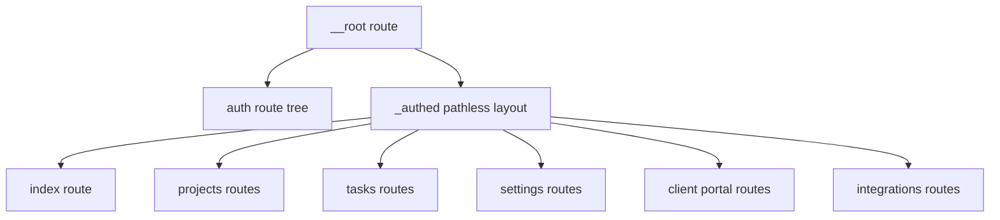

# Desktop Route Architecture Recovery Plan

**Date:** May 11, 2026 (`2026-05-11`)

## Goal

Make `apps/user-application` structurally match the web app's routing model so the desktop app becomes dynamic, maintainable, and predictable this week.

The target state is:
- `apps/user-application` uses **file-based TanStack Router** under `src/routes`
- desktop mirrors the **route/layout shape** of `apps/web-application/src/routes`
- desktop keeps **desktop-specific shell/session behavior**
- web remains the **source of truth** for **auth and billing**
- desktop owns **account and onboarding UX/route flows**
- Convex stays the **shared cloud data source** for projects/tasks/settings

## Fixed Architectural Decisions

- **Routing target:** full migration toward **file-based TanStack routes** in desktop now
- **Ownership:** **web stays owner** of **auth and billing only**
- **Desktop responsibility:** local session transport, route protection, desktop shell/layout, dynamic project/task/settings pages, **desktop account screens**, **desktop onboarding flows**, and web deep-link handoff where needed

## What Is Wrong Today

### Desktop App (`apps/user-application`)

Current issues found in:
- `apps/user-application/src/router.tsx`
- `apps/user-application/src/app/WorkspaceFrame.tsx`
- `apps/user-application/src/app/AuthedWorkspaceLayout.tsx`
- `apps/user-application/src/features/onboarding/useNonProOnboardingGate.ts`
- `apps/user-application/src/app/DashboardContextView.tsx`

Main problems:
- one hand-built `router.tsx` acts as a **god file**
- route declarations are not organized like the web app
- `WorkspaceFrame` is repeated in views instead of owned by a route layout
- desktop has a hybrid auth story across router, Electron session bridge, React Query invalidation, and Convex auth provider bridging
- desktop uses Convex data, but route/data ownership is not expressed at route level
- settings routing is route duplication instead of a cleaner nested/search-param structure
- onboarding/account behavior does not yet have a clean desktop route/layout home

### Web App (`apps/web-application`)

Useful reference files:
- `apps/web-application/src/main.tsx`
- `apps/web-application/src/routes/__root.tsx`
- `apps/web-application/src/routes/_authed.tsx`
- `apps/web-application/src/routes/auth.tsx`
- `apps/web-application/src/routes/auth.desktop.tsx`
- `apps/web-application/src/routes/_authed/project.$id.tsx`

The web app already has the right broad shape:
- file-based routes
- pathless auth layout
- clean root route
- nested route conventions
- generated route tree
- route organization that scales

## Target Desktop Structure

Desktop should converge toward this shape:

### Root Responsibilities

Desktop root should own only:
- router-wide providers/context
- default pending/error behavior
- `DesktopShell`
- session invalidation subscription (`onSessionChanged`)
- top-level pathless/public layout composition

It should **not** own:
- every route declaration forever
- business onboarding rules
- duplicated layout logic
- screen-specific data fetching decisions

### `_authed` Responsibilities

The desktop `_authed` route should own:
- `beforeLoad` session gate via `getDesktopSession()`
- desktop shared shell layout (`WorkspaceFrame` or renamed equivalent)
- route-level chrome that should exist on all authenticated pages
- desktop-owned onboarding/account wrappers where appropriate

It should **not** own:
- billing truth
- subscription truth
- duplicated auth/billing rules already living in web/Convex

## Convex / Auth Boundary To Preserve

### Keep

- web app Convex backend under `apps/web-application/convex`
- desktop using shared generated Convex API types from web app output
- desktop Electron session bridge for local auth/session transport
- `ConvexProviderWithAuth` desktop bridge pattern in `apps/user-application/src/main.tsx`
- server-side access control in Convex functions via `ctx.auth`
- desktop-owned onboarding/account screens can still use the same Convex deployment and typed API surface

### Clean Up

- stop letting route/layout design drift from web app conventions
- reduce the number of surfaces that appear to own auth
- remove `anyApi`-style weak typing where possible and prefer typed generated API imports consistently
- make router/session/Convex roles explicit:
  - router decides navigation
  - Electron bridge provides session/token transport
  - Convex owns protected data and authorization

## Implementation Phases

## Phase 1 — Freeze The Architecture And Stop New Drift

Goal: stop making the current structure worse while migration begins.

Actions:
- treat `apps/user-application/src/router.tsx` as transitional only
- do not add new route logic to leaf views unless unavoidable
- do not add more `WorkspaceFrame` wrappers to individual screens
- document the ownership split in `apps/user-application/docs/05-11/05-11-tanstack-router-auth-en-data.md`

Success condition:
- everyone follows one rule set during the migration week

## Phase 2 — Introduce Desktop File-Based Routing Scaffold

Goal: make desktop structurally resemble web routing before moving many pages.

Files to create or reorganize:
- `apps/user-application/src/routes/__root.tsx`
- `apps/user-application/src/routes/_authed.tsx`
- `apps/user-application/src/routes/auth.tsx`
- `apps/user-application/src/routes/index.tsx`
- route files for projects/tasks/settings/portal/integrations
- router bootstrap aligned with web app conventions
- generated route tree setup for desktop app

Actions:
- enable TanStack Router file-based plugin for desktop build if not already enabled
- move root route composition out of the current manual tree
- model desktop route tree after web route organization, not necessarily identical paths but identical structure
- define root route context if needed for query client / desktop bridge references
- carry over default pending/error/router defaults from web where appropriate

Success condition:
- desktop route generation works
- desktop route tree is no longer manually centralized in one giant file

## Phase 3 — Move Shared Authenticated Chrome Into Route Layouts

Goal: remove repeated `WorkspaceFrame` ownership from page components.

Files likely touched:
- `apps/user-application/src/app/WorkspaceFrame.tsx`
- `apps/user-application/src/app/AuthedWorkspaceLayout.tsx`
- dashboard/project/task/settings/client portal screens that currently wrap themselves

Actions:
- decide whether `WorkspaceFrame` becomes the `_authed` layout body directly or is absorbed into `AuthedWorkspaceLayout`
- remove repeated page-level wrapping from views like dashboard/tasks/projects
- define explicit exceptions for pages that should not use standard chrome (for example full-screen create/project/editor-style views)
- mirror web's pathless layout usage pattern

Success condition:
- authenticated chrome is route-owned, not page-owned
- pages become mostly content components

## Phase 4 — Rebuild Auth/Public Route Structure Around Desktop Realities

Goal: keep web ownership of auth/billing, while making desktop routing clean.

Files:
- desktop root/auth route files
- `apps/user-application/src/lib/desktopSession.ts`
- `apps/user-application/src/lib/auth.tsx`
- desktop auth screens and deep-link bridge files

Actions:
- keep `/auth` as a public route tree
- keep desktop `beforeLoad` session gating in `_authed`
- define one clear redirect contract (`/auth` if no session, `/` if already authed)
- preserve the system-browser + deep-link login model
- do not replicate **web auth or billing** flows into local desktop state machines
- allow **desktop account and onboarding** route trees under `_authed`

Success condition:
- desktop has clean route protection
- auth ownership is obvious
- web remains business owner

## Phase 5 — Make Key Desktop Pages Properly Dynamic Through Route Structure

Goal: get dynamic routes/pages working fast this week.

Priority route groups:
- dashboard
- projects
- project detail
- tasks
- task detail
- settings
- client portal preview if still relevant in desktop

Actions:
- create route files for these pages first
- move route-specific `validateSearch` and param typing into route modules
- use route organization patterns from web for nested parent/detail routes
- decide where parent route + child route should use `Outlet` vs render default detail view
- keep component-level data hooks at first where needed, then gradually move critical preloads to route loaders

Success condition:
- desktop primary app areas are dynamic and route-native
- route params/search typing is cleaner and easier to evolve

## Phase 6 — Rationalize Data Loading With TanStack Query + Convex

Goal: stop the current ambiguity around where data should load.

Guiding rule:
- **critical navigation/auth checks** in `beforeLoad`
- **critical route data** gradually moved to route loaders with `ensureQueryData` when practical
- **Convex authorization** remains in Convex functions
- **mutations** remain in components/thin hooks

Actions:
- introduce route-level loaders only for the places where they clearly help navigation correctness or perceived performance
- keep query key discipline and central key factories where beneficial
- audit duplicated session/data query keys
- standardize typed API usage and remove `anyApi` call sites where possible

Success condition:
- there is a repeatable rule for when data belongs in router vs component
- no more ad hoc pattern per screen

## Phase 7 — Untangle Settings/Account/Billing/Onboarding Route Semantics

Goal: remove messy route duplication while keeping only auth/billing ownership in web.

Actions:
- decide whether desktop settings/account tabs should be nested routes or validated search params
- keep **account screens local to desktop**
- keep **onboarding screens/modal flows local to desktop**
- make **billing** actions route cleanly to delegated web-owned flows where needed
- do not create separate desktop billing truth

Success condition:
- settings navigation is clean and typed
- account/onboarding are clearly desktop-owned
- auth/billing ownership remains in web

## Phase 8 — Desktop/Web Boundary Cleanup

Goal: stop architecture drift between apps.

Actions:
- define which routes exist in both apps and which are desktop-only
- define which flows are delegated to web from desktop (**auth, billing**)
- define which flows are explicitly desktop-owned (**account, onboarding**)
- create a small architecture note mapping:
  - desktop shell routes
  - shared product data routes
  - delegated web auth/billing flows
  - desktop-owned account/onboarding flows
- replace weak cross-app imports where possible with a clearer shared package strategy later

Success condition:
- desktop and web no longer feel like two accidental products

## Week Execution Order

If the goal is to get this functioning this week, the order should be:

1. file-based router scaffold in desktop
2. `_authed` layout + shell ownership
3. migrate dashboard/projects/tasks/settings routes first
4. stabilize auth/public route flow
5. tighten Convex/query typing and loader strategy
6. clean up delegated auth/billing paths and local account/onboarding paths

## Highest-Risk Areas

- breaking desktop auth handoff while moving route ownership
- letting Convex auth and desktop Electron session drift again
- moving too many pages before the layout boundary is stable
- recreating web business logic locally in desktop out of urgency
- keeping `WorkspaceFrame` half route-owned and half page-owned

## Concrete Deliverables By End Of Week

- desktop file-based TanStack route tree exists
- root/public/authed layout split is clean
- dashboard/projects/tasks/settings are routed through the new structure
- auth/billing ownership is explicitly delegated to web where appropriate
- account/onboarding ownership is explicitly local to desktop
- desktop keeps only desktop-specific session shell + dynamic data views
- the May 11 architecture doc becomes an accurate source of truth, not a partial note

## Files To Study And Likely Touch First

### Desktop
- `apps/user-application/src/router.tsx`
- `apps/user-application/src/main.tsx`
- `apps/user-application/src/app/WorkspaceFrame.tsx`
- `apps/user-application/src/app/AuthedWorkspaceLayout.tsx`
- `apps/user-application/src/lib/desktopSession.ts`
- `apps/user-application/src/lib/auth.tsx`
- `apps/user-application/src/app/DashboardContextView.tsx`
- `apps/user-application/src/settings/components/SettingsPageView.tsx`

### Web References
- `apps/web-application/src/main.tsx`
- `apps/web-application/src/routes/__root.tsx`
- `apps/web-application/src/routes/_authed.tsx`
- `apps/web-application/src/routes/auth.tsx`
- `apps/web-application/src/routes/auth.desktop.tsx`
- `apps/web-application/src/routes/_authed/project.$id.tsx`
- `apps/web-application/convex/auth.ts`
- `apps/web-application/convex/desktop.ts`

## Non-Goals For This Week

- redesigning Rust sidecar architecture
- replacing Electron auth transport
- moving Convex backend out of web app this week
- inventing a second auth/billing backend in desktop
- polishing every screen visually before route ownership is fixed

## Final Recommendation

Do **not** try to \"fix messy code everywhere\" first.

Do this in order:
- fix **route architecture first**
- move **shell/layout ownership** into routes
- keep **web as auth/billing owner**
- make **desktop the account/onboarding owner**
- then make the desktop pages dynamic on top of that structure

That gives you the fastest path to a desktop app that behaves like the web app structurally, without blowing up the auth/billing/onboarding boundary.
