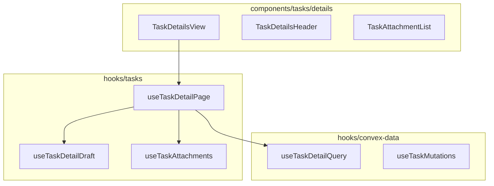

# Desktop tasks — refactor plan (hooks + nette bestanden)

Last updated: 2026-06-04  
Audience: engineering (build order)  
Related: [`04-06-2026-DESKTOP-TASKS-KANBAN-EN-TAAKDETAIL.md`](./04-06-2026-DESKTOP-TASKS-KANBAN-EN-TAAKDETAIL.md) · [`05-29-frontend-architecture-cleanup-plan.md`](../05-29/05-29-frontend-architecture-cleanup-plan.md) · [`30-05-data-fetching-and-what-is-broken.md`](../30-05/30-05-data-fetching-and-what-is-broken.md)

> **Canonical plan** for cleaning up desktop task detail, kanban, and Convex `boardStatus`.  
> Feature changelog / eerste implementatie: sibling doc above. **Geen web-app** in deze pass.

---

## Locked decisions

| # | Decision | Choice |
|---|----------|--------|
| A | Scope | Alleen `apps/user-application` + `packages/data-ops` (Convex) |
| B | Gedrag | Zelfde productgedrag als nu: autosave titel/description, R2 attachments, kanban-kolom opslaan, fase bij create, Complete Project |
| C | Architectuur | [05-29 Phase 5](https://github.com): views dun, hooks = state + mutations; **max ~350 regels per bestand** |
| D | Twee borden | `/tasks` = `priority` (`desktop.setTaskPriority`); project-kanban = `boardStatus` (`desktop.setTaskKanbanColumn`) — blijven gescheiden |
| E | `boardStatus` in schema | Blijft **optional** voor oude rijen; alle **nieuwe** inserts krijgen default `todo` |
| F | Task detail data | `api.tasks.getDetail` / `update` / attachments — niet `api.desktop` |
| G | Legacy | `CreateTaskModal` verwijderen als ongebruikt (UI = `CreateTaskDialog`) |

---

## Probleem (waarom refactor)

| Bestand | Regels | Probleem |
|---------|--------|----------|
| `components/tasks/TaskDetailsView.tsx` | ~546 | Query + 4× `useConvexMutation` + draft + upload + nav in één view |
| Draft | `useEffect` | Server → lokale kopie; Convex refresh kan typen wissen |
| Attachments | dubbele state | `task.attachments` + `useState` + handmatige delete |
| `hooks/project/useKanbanBoard.ts` | ~225 | Checkbox togglet `isCompleted` in kolom; kaart springt niet naar Done tot refresh |
| Convex | meerdere inserts | `addTaskForUser`, project seed tasks zonder `boardStatus` |
| `hooks/convex-data/useTaskMutations.ts` | ~225 | Mix `api.desktop.*` + `api.tasks.*` zonder structuur |

**Goede voorbeelden in repo:** `TasksPageView` + `useTasksBoard`; `useProjectAssetUploads` (R2 in hook).

---

## Architectuur (doel)

```txt
Route tasks.$taskId.tsx
  → components/tasks/details/TaskDetailsView.tsx   (~120 regels JSX)
       → hooks/tasks/useTaskDetailPage.ts
            → useTaskDetailQuery (Convex getDetail)
            → useTaskDetailDraft (title/content + debounced update)
            → useTaskAttachments (R2 + save/delete, geen lokale attachment list)
            → useDeleteTaskMutation / useToggleTaskCompletionMutation

Project overview
  → components/project/kanban/KanbanBoard.tsx
       → hooks/project/useKanbanBoard.ts (drag + kolom-mutatie + checkbox kolom-move)
```



---

## Progress audit

Status: ⬜ todo · 🟡 in progress · ✅ done

| Step | What | Status | Notes |
|-----:|------|:------:|-------|
| 0 | Eerste feature pass (kanban, detail live, Complete Project) | ✅ | Zie [`04-06-2026-DESKTOP-TASKS-KANBAN-EN-TAAKDETAIL.md`](./04-06-2026-DESKTOP-TASKS-KANBAN-EN-TAAKDETAIL.md) |
| 1 | Task detail hooks + split views | ⬜ | PR1 |
| 2 | Kanban checkbox kolom-sync | ⬜ | PR2 |
| 3 | Convex `boardStatus` op alle inserts | ⬜ | PR3 |
| 4 | `useTaskMutations` opschonen + attachment wrappers | ⬜ | PR3 |
| 5 | Legacy `CreateTaskModal` weg + doc sync | ⬜ | PR4 |

---

## Phase 1 — Task detail refactor (PR1)

### 1.1 Nieuwe hooks (`hooks/tasks/`)

| Hook | Bestand | Verantwoordelijkheid |
|------|---------|---------------------|
| `useTaskDetailQuery` | `useTaskDetailQuery.ts` | `useQuery(api.tasks.getDetail)`, `isLoading`, `isNotFound` |
| `useTaskDetailDraft` | `useTaskDetailDraft.ts` | `title`/`content`, **isDirty**, reset alleen bij `taskId` wijziging; debounce 600ms / 900ms → `useUpdateTaskMutation` |
| `useTaskAttachments` | `useTaskAttachments.ts` | Zelfde keten als `useProjectAssetUploads`: validate → `uploadFileToR2` → `saveAttachment`; `uploading` + ref tegen dubbel-submit |
| `useTaskDetailPage` | `useTaskDetailPage.ts` | Compose + `goBack` / `openLinkedProject` uit route search |

Export via nieuw [`hooks/tasks/index.ts`](../../src/hooks/tasks/index.ts).

**Draft-regels (fix description niet bewerkbaar):**

- Geen sync van server naar draft terwijl `isDirty`.
- Geen lokale `attachments` state — render `detail.task.attachments` uit query.
- Geen `useConvexMutation` in views.

### 1.2 Components (`components/tasks/details/`)

| Bestand | Max regels | Inhoud |
|---------|------------|--------|
| `TaskDetailsView.tsx` | ~150 | Shell: loading, not-found, compose |
| `TaskDetailsHeader.tsx` | ~120 | Back, titel, meta, label Description, menu |
| `TaskAttachmentList.tsx` | ~80 | Lijst + hidden input + Attach File |

Update import: [`routes/_authed/tasks.$taskId.tsx`](../../src/routes/_authed/tasks.$taskId.tsx).

### 1.3 Convex-data wrappers

In [`hooks/convex-data/`](../../src/hooks/convex-data/):

- `useSaveTaskAttachmentMutation` / `useDeleteTaskAttachmentMutation` (wrap `api.tasks.saveAttachment` / `deleteAttachment`)
- Optioneel `useTaskDetailQuery` hier i.p.v. onder `hooks/tasks` — kies **één** import-pad voor views

---

## Phase 2 — Kanban checkbox (PR2)

Bestand: [`hooks/project/useKanbanBoard.ts`](../../src/hooks/project/useKanbanBoard.ts)

| Task | Detail |
|------|--------|
| `toggleTaskCompletion` | Na toggle: verplaats kaart naar `done` of terug naar `in-progress` (match [`toggleTaskForUser`](../../../packages/data-ops/convex/domain/projects/service.ts)) |
| API | Bij kolomwijziging: `useSetTaskKanbanColumnMutation` **of** toggle + expliciete kolom-move in optimistic state — één bron van waarheid |
| Export | `useKanbanBoard` toevoegen aan [`hooks/project/index.ts`](../../src/hooks/project/index.ts) |

Optioneel: `lib/project/kanbanMove.ts` — gedeelde “verwijder uit alle kolommen + insert” helper (alleen project-kanban, niet priority board).

---

## Phase 3 — Convex `boardStatus` + mutations (PR3)

### 3.1 Inserts altijd `boardStatus`

| Locatie | Wijziging |
|---------|-----------|
| [`addTaskForUser`](../../../packages/data-ops/convex/domain/projects/service.ts) | `boardStatus: "todo"` (of parameter) |
| Project create / `addPhase` seed tasks | default `boardStatus: "todo"` |
| [`createProjectTaskForApi`](../../../packages/data-ops/convex/domain/projects/service.ts) | Align met `desktop.createTask` (`phaseId`, `boardStatus`) |

Fallback blijft in [`kanbanColumns.ts`](../../src/lib/project/kanbanColumns.ts) `getTaskStatus()` voor oude rijen.

### 3.2 `useTaskMutations` structuur

Split of duidelijke secties:

- **Desktop board:** `createTask`, `setTaskPriority`, `setTaskKanbanColumn`, `deleteTask`
- **Task record:** `update`, `toggleComplete`, `setAssignees`, attachment mutations

Bestanden (voorstel):

- `hooks/convex-data/useDesktopTaskMutations.ts`
- `hooks/convex-data/useTaskRecordMutations.ts`
- `useTaskMutations.ts` re-export barrel (optioneel)

---

## Phase 4 — Cleanup (PR4)

| Task | Actie |
|------|--------|
| `CreateTaskModal.tsx` | Verwijderen + re-export uit `TasksPageView` weg |
| `models/project/project.ts` | `status` op kanban-pad vermijden; gebruik `boardStatus` in `mapTask` / `getTaskStatus` |
| Docs | Deze file + audit-tabel in sibling changelog bijwerken na merge |

---

## PR-volgorde (klein reviewbaar)

1. **PR1** — Hooks + split task detail (geen Convex schema-wijziging)
2. **PR2** — Kanban toggle + export hook
3. **PR3** — Convex inserts + mutation file split
4. **PR4** — Legacy modal + doc

---

## Verification

### Commands

```bash
pnpm --dir packages/data-ops run build
pnpm --dir apps/user-application exec tsc --noEmit
```

Convex: deploy schema met optioneel `boardStatus` (geen backfill verplicht).

### Handmatig

- [ ] Project-kanban: drag kolom → refresh → kolom blijft
- [ ] `+` in To-do → taak in To-do; fase-dropdown werkt
- [ ] Taakdetail: typ description/titel → Saved → refresh behoudt tekst
- [ ] Attach file (vanuit project, `projectId` in URL)
- [ ] Kanban checkbox: kaart naar/van Done zonder refresh
- [ ] Complete Project → status Completed

---

## Audit-tabel (na refactor)

| # | Onderdeel | Voor refactor | Na refactor (doel) |
|---|-----------|---------------|---------------------|
| 1 | TaskDetailsView regels | ~546 | &lt; 150 + subcomponents |
| 2 | Convex in view | 4 raw mutations | 0 |
| 3 | Attachment state | Dubbel | Alleen query |
| 4 | Draft sync | `useEffect` op task | `taskId` + dirty |
| 5 | Kanban checkbox | Kolom niet verplaatst | Optimistic kolom-move |
| 6 | Seed tasks `boardStatus` | Ontbreekt | `todo` default |
| 7 | Legacy CreateTaskModal | Re-export | Verwijderd |

---

## Wanneer uitvoeren

Zeg in Cursor: **“voer het plan uit”** / **“execute 04-06-2026-DESKTOP-TASKS-REFACTOR-PLAN”** — dan PR1→PR4 in volgorde, zonder extra scope.
