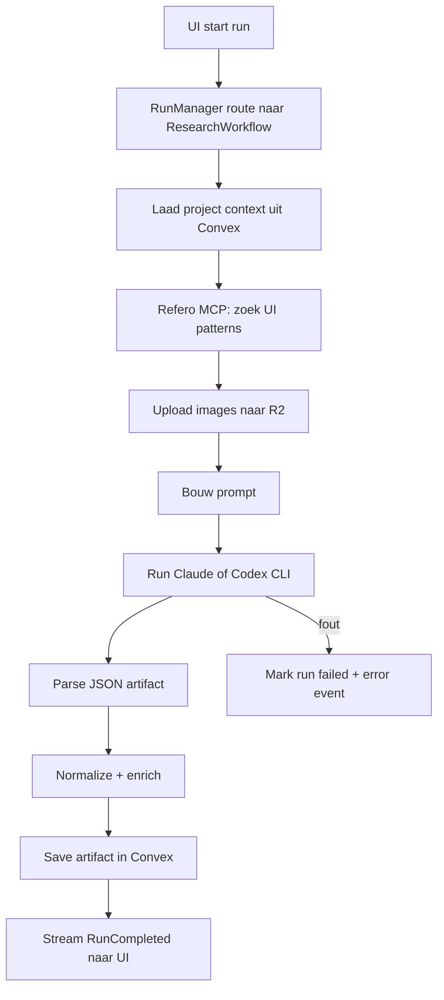

# Hoe `workflow.rs` werkt — uitleg voor freelance pitches

Datum: 7 juni 2026  
Context: Stage monorepo, `apps/stage-engine` (Rust sidecar)

Dit document legt uit hoe jullie AI-orchestration werkt, zodat je het kunt vertalen naar vacatures die **LangChain, LangGraph, FastAPI, RAG, observability** of **engineering software** vragen.

---

## In één zin

`workflow.rs` is jullie **eigen LLM-pipeline orchestrator**: een expliciete, stap-voor-stap async flow in Rust die context laadt, externe tools aanroept, een LLM draait, output normaliseert, opslaat en live events naar de UI stuurt — **zonder** LangChain of LangGraph.

---

## Waar zit het in de architectuur?

```txt
Electron desktop app (React)
        │
        │  POST /v1/runs  (start AI job)
        ▼
stage-engine (Rust, localhost:48221)
        │
        ├─ RunManager        → kiest workflow op basis van mode
        ├─ research/workflow.rs
        ├─ strategy/workflow.rs
        ├─ moodboard/workflow.rs
        ├─ flows/workflow.rs
        └─ wireframes/workflow.rs
        │
        ├─ Convex            → projectdata, runs, artifacts
        ├─ Refero MCP        → design screenshots / patterns
        ├─ Claude / Codex CLI → LLM via subprocess
        └─ SSE / WebSocket   → live status naar UI
```

Jij bouwt dus **production-grade AI pipelines** met:
- async orchestration
- tool steps met observability events
- structured output parsing + normalisatie
- persistence + failure handling
- cancel + dedupe

Dat is precies wat veel LangGraph-vacatures bedoelen — alleen dan custom gebouwd in Rust i.p.v. een Python graph framework.

---

## Wat doet één `workflow.rs` concreet?

Elke workflow (Research, Strategy, Moodboard, Flows, …) volgt hetzelfde patroon. Research is het referentiemodel.

### Stappen in `research/workflow.rs`

| Stap | Wat gebeurt er | Vergelijkbaar met vacature-taal |
|------|----------------|----------------------------------|
| 1. Validatie | Check auth token + project id | API guard / dependency injection |
| 2. Context laden | `fetch_research_input` uit Convex | Upstream data contract |
| 3. Run registreren | `create_research_run` in database | Run tracking / observability |
| 4. Tool: Refero | MCP zoeken, images naar R2 uploaden | Tool node in LangGraph |
| 5. Prompt bouwen | `build_research_prompt(...)` | Prompt engineering |
| 6. LLM run | `run_provider_collect` → Claude/Codex CLI | LLM pipeline execution |
| 7. Parse + normalize | JSON extractie, drift fix, merge | Structured outputs |
| 8. Opslaan | `complete_research_run` → Convex artifact | Downstream data contract |
| 9. Events | `RunCompleted` / `RunFailed` naar UI | Streaming + observability |

### Vereenvoudigde flow (Research)



### Code-anker (het hart van de orchestration)

Het patroon in elke workflow:

1. `run(...)` ontvangt `run_id`, `request`, `auth_token`, `sink`, `cancel_rx`
2. Binnen `async { ... }` worden stappen sequentieel uitgevoerd
3. `tool_started` / `tool_completed` events voor tussenstappen (UI ziet voortgang)
4. Bij error → Convex run op `failed` zetten + `RunFailed` event
5. Bij cancel → netjes stoppen zonder corrupte state

Dat is **handgeschreven orchestration** — hetzelfde idee als LangGraph nodes/edges, maar expliciet in code zodat je volledige controle hebt.

---

## Hoe dit past bij jouw FastAPI-ervaring

Veel vacatures vragen FastAPI + LangGraph. Jij kunt het zo framen:

| Vacature vraagt | Jij hebt (Stage) | Jij hebt (FastAPI, als je dat ook deed) |
|-----------------|------------------|----------------------------------------|
| FastAPI async API | Axum + Tokio async HTTP in stage-engine | `async def` endpoints, background tasks |
| LLM pipelines | `workflow.rs` per feature | FastAPI route → service → OpenAI/Anthropic call |
| LangChain / LangGraph | Eigen RunManager + workflow modules | Chains/agents in Python (als je dat deed) |
| Structured outputs | `normalize.rs`, `extract_*_artifact` | Pydantic models + JSON schema |
| Observability | `RunEvent`, tracing, tool steps | Logging, Langfuse, OpenTelemetry |
| RAG | Refero context + Convex artifacts | Vector DB + retrieval step vóór LLM |
| HITL | Regenerate per section/screen in UI | Human approves/edits vóór save |
| Event-driven | SSE run events, broadcast channel | WebSockets, Celery, Redis pub/sub |
| PostgreSQL | Convex (ander DB-model, zelfde idee) | SQLAlchemy + Postgres |

**Pitch-zin voor vacature 1 (LangGraph/FastAPI):**

> Ik heb production LLM pipelines gebouwd met expliciete orchestration: context loading, tool steps, provider execution, structured output normalization, persistence en streaming observability — vergelijkbaar met LangGraph, maar custom in Rust voor een desktop sidecar met lokale Claude/Codex CLI's. Daarnaast heb ik vergelijkbare async API-patterns met FastAPI gebruikt.

**Pitch-zin voor vacature 2 (Azure RAG chatbot):**

> Ik heb RAG-achtige pipelines gebouwd: externe knowledge ophalen (Refero/MCP), context injecteren in prompts, LLM output structureren en opslaan als doorzoekbaar artifact. Het patroon (retrieve → augment → generate → persist) is hetzelfde; de stack was Convex + custom orchestration i.p.v. Azure AI Search.

---

## Welke freelance jobs passen het beste?

| Vacature | Match met jouw workflow-ervaring |
|----------|----------------------------------|
| **LLM pipelines / LangGraph / observability** | Zeer sterk — dit is letterlijk wat `workflow.rs` + `RunManager` doen |
| **FastAPI + async Python APIs** | Sterk als je FastAPI ook echt deed; Stage toont hetzelfde architectuurdenken |
| **Azure AI Search RAG** | Conceptueel sterk (retrieve + chat); stack anders (Python/Azure) |
| **Full stack React + industrial software** | Matig op AI-deel; sterker als je ook dashboards/API's voor technische data deed |

---

## Wat is "engineering software"?

In vacatures (zoals Karlsruhe, optical measurement) bedoelen ze meestal:

> Software voor **technische / industriële** domeinen — niet een webshop of marketing site, maar tools voor ingenieurs, operators, labmedewerkers of machines.

Het gaat om software die **meetdata, sensoren, machines, simulaties of technische workflows** ondersteunt.

### Voorbeelden — heb jij dit gedaan? (ja/nee per item)

| # | Voorbeeld | Wat het is |
|---|-----------|------------|
| 1 | **Metrology / measurement dashboard** | Webapp die meetresultaten van machines/sensoren toont (grafieken, tolerances, alarms) |
| 2 | **SCADA / equipment monitoring** | Real-time status van fabrieksinstallaties, pompen, ovens, productielijnen |
| 3 | **CAD/CAM of BIM tooling** | Software rond ontwerp/tekeningen (AutoCAD-achtig, Revit plugins, 3D viewers) |
| 4 | **Lab instrument software** | App die labapparatuur aanstuurt of testresultaten verwerkt (LIMS-achtig) |
| 5 | **Machine connectivity API** | API die praat met hardware via MQTT, OPC-UA, Modbus, serial, CAN bus |
| 6 | **Simulation / FEA / CFD tools** | Software voor engineering berekeningen (belasting, stroming, warmte) |
| 7 | **GIS / infrastructure planning** | Kaarten + technische lagen voor nutsbedrijven, wegen, leidingen |
| 8 | **Medical device / diagnostic software** | Gereguleerde software gekoppeld aan medische apparatuur (niet consumer health apps) |
| 9 | **Automotive diagnostic tools** | OBD, ECU data, fleet telematics voor voertuigen |
| 10 | **Industrial analytics platform** | Aggregatie van sensor/machine data + dashboards voor onderhoud of kwaliteit |
| 11 | **PLC / robot programming interfaces** | UI om robots of PLC's te configureren of te monitoren |
| 12 | **Energy / solar / wind monitoring** | Dashboards voor opwekking, storingen, performance ratio |

**Stage zelf** is eerder **product/design AI software** (SaaS + desktop) — dat is engineering-achtig in **architectuur** (sidecar, pipelines, data contracts), maar niet klassiek "industrial metrology".

Voor vacature 3 (Karlsruhe) zou je eerlijk zeggen:
- **Ja** op: full stack, React, API's, dashboards, cloud + on-prem patterns, testing
- **Sterk** op: complexe technische software bouwen (AI orchestration)
- **Alleen ja** op "industrial/engineering software" als je één of meer items uit de tabel hierboven echt hebt gedaan

---

## Korte pitch-blokken (copy-paste voor sollicitatie)

### AI orchestration (vacature 1)

```
Ik ontwerp en bouw production LLM workflows end-to-end:
- async orchestration met expliciete stappen (context → tools → LLM → normalize → persist)
- structured output parsing en schema-normalisatie
- run lifecycle: start, cancel, dedupe, failure recovery
- live observability via streaming events per tool/step
- integratie met externe knowledge sources (MCP/RAG-achtig)

Stack: Rust (Axum/Tokio) + Convex + lokale Claude/Codex CLI's.
Vergelijkbaar patroon ook gebouwd met FastAPI + async Python.
```

### RAG / search (vacature 2)

```
Ervaring met retrieve-augment-generate pipelines:
document/context ophalen, prompt verrijken, LLM antwoord structureren,
resultaat persistent opslaan voor latere UI-queries.
Focus op betrouwbare data contracts en foutafhandeling in productie.
```

### Full stack + technical domain (vacature 3)

```
Full stack: React dashboards, backend API's, SQL/Postgres-achtige data flows,
deployment en testdiscipline. Ervaring met complexe technische productsoftware
(niet alleen CRUD sites). [Vul aan met concrete engineering-voorbeelden uit tabel.]
```

---

## Bestanden om te kennen (als iemand doorvraagt)

| Bestand | Rol |
|---------|-----|
| `apps/stage-engine/src/research/workflow.rs` | Referentie-orchestrator |
| `apps/stage-engine/src/runs/mod.rs` | Run routing, dedupe, cancel, events |
| `apps/stage-engine/src/providers/adapter.rs` | Claude/Codex provider switch |
| `apps/stage-engine/src/providers/process.rs` | CLI subprocess + stream parsing |
| `apps/stage-engine/ARCHITECTURE.md` | Officiële module-conventies |
| `packages/data-ops/convex/...` | Backend persistence + handlers |

---

## Volgende stap voor jou

1. Geef per voorbeeld in de engineering-tabel **ja/nee** — dan kan ik je pitch precies afstemmen.
2. Zeg welke FastAPI-projecten je wilt noemen (RAG? agents? alleen REST?) — dan koppel ik die aan dezelfde workflow-taal.
3. Optioneel: één pagina CV-bullet maken op basis van dit document.
