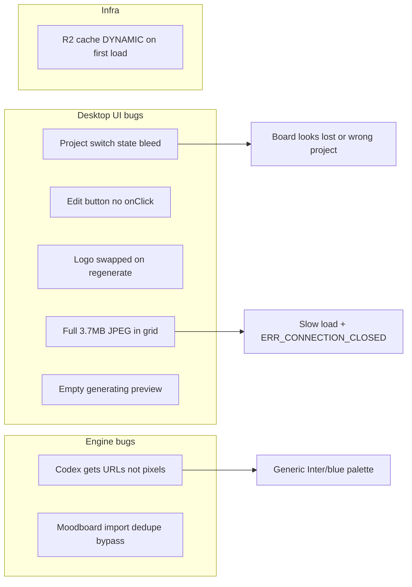

# MOODBOARD STYLE GUIDE FIX PLAN

Last updated: 2026-06-24

Related: [`MOODBOARD_DEV_STATUS.md`](./MOODBOARD_DEV_STATUS.md) · [`MOODBOARD_TESTING.md`](./MOODBOARD_TESTING.md) · [`R2_PUBLIC_DOMAIN_AUDIT.md`](../infra/R2_PUBLIC_DOMAIN_AUDIT.md)

**Status:** Planned — not started (implementation pending).

Unified plan for the full Moodboard / Style Guide experience: multi-project state isolation, Edit button, logo, fast image loading, AI that actually sees moodboard photos, engine dedupe safety, and parallel-run UX.

---

## Checklist

- [x] Phase 1 — Multi-project state isolation (`key={project.id}`)
- [x] Phase 2 — Style guide UI (logo, Edit, generating preview)
- [x] Phase 3 — Fast image loading (thumbnails + cache verify)
- [x] Phase 4 — Engine: style guide sees moodboard images
- [x] Phase 5 — Engine hardening (dedupe, merge safety)
- [x] Phase 5c — stderr artifact capture kind mismatch + failure bloat
- [ ] Phase 6 — Delete regression verified (manual)
- [ ] Manual test matrix complete (requires desktop run)

---

## Problem map

---

## Phase 1 — Multi-project state isolation (frontend)

**Symptom:** Start style guide on Project A, switch to Project B, come back — one finished, one failed, or wrong board visible.

**Root cause:** [`MoodboardTab.tsx`](../../../src/components/project/tabs/moodboard/MoodboardTab.tsx) local state is not keyed to `projectId`. Convex data **is** per-project; the UI leaks.

| Fix | File |
|-----|------|
| `key={project.id}` on `<MoodboardTab />` | [`ProjectStepView.tsx`](../../../src/components/project/ProjectStepView.tsx) |
| Reset `importRunEnded`, `styleGuideRunEnded`, `styleGuideCompletedAt`, `isGeneratingStyleGuide`, `error` on `projectId` change | [`useMoodboardTab.ts`](../../../src/hooks/project/moodboard/useMoodboardTab.ts) |
| When `!isLoading && !moodboard.data` → clear `items`, `folders`, `uploadedFiles`, `view`, `selectedIds` | [`MoodboardTab.tsx`](../../../src/components/project/tabs/moodboard/MoodboardTab.tsx) |
| Generating guard: show generating only if `runningStyleGuideDirectionId !== null` OR (`view === generating` AND `isGeneratingStyleGuide`) | [`MoodboardTab.tsx`](../../../src/components/project/tabs/moodboard/MoodboardTab.tsx) |
| `hydratedProjectId` ref — block `persistBoard` until current project hydrated | [`MoodboardTab.tsx`](../../../src/components/project/tabs/moodboard/MoodboardTab.tsx) |

**Parallel-run UX (same phase):**

- App-level query: any project with `listRuns(module: styleguide, status: running)`
- Small banner in Moodboard tab: "Style guide still generating in **{projectName}**"
- Soft confirm before starting a second style guide while another is running (shared Codex CLI)

**Verdict:** You should **not** need to stick to one moodboard until done — that was a UI bug workaround.

---

## Phase 2 — Style guide UI fixes (frontend)

### 2a. Stage logo on regenerate

**Bug:** [`StyleGuideGenerating.tsx`](../../../src/components/project/tabs/moodboard/StyleGuideGenerating.tsx) swapped `/logos/stage.svg` → `/logos/dashboard/moodboard.svg` on regenerate.

**Fix:** Always use `/logos/stage.svg` + `brightness-0`. Only the label changes ("Regenerating style guide…").

**Status:** Fix applied locally — include in PR and verify.

### 2b. Edit button (currently dead)

**Bug:** [`StyleGuideView.tsx`](../../../src/components/project/tabs/moodboard/StyleGuideView.tsx) — `HeaderButton` for Edit has **no `onClick`**. Regenerate works; Edit does nothing.

**Fix (mirror Strategy tab pattern):**

1. Add `isEditing` state in `MoodboardTab` (or `StyleGuideView` with callbacks).
2. Edit click → `setIsEditing(true)`; header shows **Save** + **Cancel** instead of Edit.
3. In edit mode, make existing controls persist:
   - Atmosphere sliders → interactive (currently read-only display in `AtmosphereMetric`)
   - Typography preview size / font family / Add row (already in component state)
   - Optional ponytail v1: skip color palette hex editing until v2
4. Save → `saveStyleGuide(directionId, editedGuide)` in [`useMoodboardTab.ts`](../../../src/hooks/project/moodboard/useMoodboardTab.ts):
   - Load current artifact styleGuides
   - Replace guide for `directionId`
   - Call existing `saveArtifact` with merged board state + updated styleGuides
5. Cancel → revert local draft from Convex snapshot.

**Files:** `StyleGuideView.tsx`, `MoodboardTab.tsx`, `useMoodboardTab.ts`

### 2c. Generating screen preview (empty grey box)

**Bug:** Top card in `StyleGuideGenerating` is always empty gradient — no moodboard preview.

**Fix:** Pass first direction reference `thumbnailUrl` (or `imageUrl`) into `StyleGuideGenerating` from `MoodboardTab`. Render `` inside the grey card with `object-cover`. Fallback: keep gradient if no image.

---

## Phase 3 — Fast image loading (frontend + infra)

**Symptom:** `IMG_2623.CR2.jpg` (3.7MB) slow; `ERR_CONNECTION_CLOSED` on `assets-testing.getstage.co`; grid loads full file for every tile.

**Root cause:** Upload sets same R2 key for `imageUrl`, `thumbnailUrl`, and `image` ([`useMoodboardTab.ts`](../../../src/hooks/project/moodboard/useMoodboardTab.ts)). No thumbnail generation. Cloudflare returns `cf-cache-status: DYNAMIC` (no edge cache hit on first load).

### 3a. Client-side thumbnails on upload (code)

1. Add small helper `createImageThumbnail(file, maxEdgePx)` — canvas resize, JPEG ~80% quality, target ~200KB.
2. In `uploadFiles`: upload **full** file + **thumbnail** as two R2 objects (same `moodboard-upload` purpose, thumb key suffix e.g. `-thumb.jpg`).
3. Set artifact fields:
   - `imageAssetKey` / `imageUrl` → full
   - `thumbnailAssetKey` / `thumbnailUrl` → thumb
   - `image` in UI state → data URL for instant preview (unchanged)
4. [`MoodboardGrid.tsx`](../../../src/components/project/tabs/moodboard/MoodboardGrid.tsx) already prefers `thumbnailUrl` first for grid — will auto-benefit.
5. [`DirectionHub.tsx`](../../../src/components/project/tabs/moodboard/DirectionHub.tsx) uses `item.image` — switch to `thumbnailUrl ?? image`.

**Files:** new util e.g. `lib/imageThumbnail.ts`, `useMoodboardTab.ts`, optionally `DirectionHub.tsx`

### 3b. Cloudflare cache rule (infra — manual)

Per [`R2_PUBLIC_DOMAIN_AUDIT.md`](../infra/R2_PUBLIC_DOMAIN_AUDIT.md):

- Cache rule: hostname `assets-testing.getstage.co`, edge TTL 7 days
- Verify: second page reload shows `cf-cache-status: HIT` or `(disk cache)`

No code change — checklist item before closing Phase 3.

---

## Phase 4 — Style guide AI must see moodboard images (engine)

**Symptom:** Style guide returns generic Inter / Operational Blue / Graphite — nothing from your sports-team photo.

**Root cause:** Prompt only embeds JSON with URLs ([`styleguide/prompt.rs`](../../../../stage-engine/src/styleguide/prompt.rs)). Codex runs in `read-only` sandbox and **cannot fetch** `assets-testing.getstage.co` (logs: `Could not resolve host`, then useless `web search` on the URL).

**Fix:** Engine fetches images **before** provider run (same pattern as moodboard import [`moodboard/workflow.rs`](../../../../stage-engine/src/moodboard/workflow.rs) `fetch_importable_image_url`):

1. In [`styleguide/workflow.rs`](../../../../stage-engine/src/styleguide/workflow.rs), after building `references`:
   - For each reference with `imageUrl` / resolved public URL / asset key → fetch bytes via HTTP (engine has network)
   - Validate with `looks_like_image_bytes`
   - Write to temp file in provider working dir
   - Push `RunAttachment { kind: Image, local_path, mime_type }` onto `request.attachments`
2. Codex already supports `--image` per attachment ([`providers/codex.rs`](../../../../stage-engine/src/providers/codex.rs))
3. Update prompt text: "Attached images are the visual source of truth for this Direction" — de-emphasize URL JSON
4. Cap attachments (e.g. max 6 refs, resize if >2MB before write) to avoid CLI limits
5. Add Rust unit test: mock reference metadata → attachment paths populated

**Files:** `styleguide/workflow.rs`, `styleguide/prompt.rs`, optional shared helper extracted from moodboard fetch logic

---

## Phase 5 — Engine hardening (same-project safety)

### 5a. Moodboard import dedupe

**Bug:** [`runs/mod.rs`](../../../../stage-engine/src/runs/mod.rs) skips dedupe when `context.source` is set. Moodboard imports always set source → two Refero/Figma imports on **same project** run parallel → last-write-wins artifact race.

**Fix:** Always dedupe moodboard runs per `(projectId, Moodboard)` regardless of `source`. Product call: **one import at a time per project** (recommended ponytail).

### 5b. Styleguide merge safety

When saving board from UI while styleguide run in flight, `saveBoard` uses stale `styleGuides` from closure ([`useMoodboardTab.ts`](../../../src/hooks/project/moodboard/useMoodboardTab.ts)).

**Fix:** Before manual save, re-read latest artifact styleGuides from `moodboardArtifact.data` — never overwrite with empty/stale array.

### 5c. stderr artifact capture kind mismatch + failure bloat

**Symptom:** Styleguide run hits Codex usage limit → user sees a long error string containing the full `strategyArtifact` JSON ("random content") instead of a clean session-limit message.

**Root cause:**
1. Styleguide prompt embeds strategy artifact JSON as context.
2. Codex echoes the strategyArtifact JSON back on stderr (input context noise).
3. `StderrArtifactCapture::ingest` ([`providers/process/stderr.rs`](../../../../stage-engine/src/providers/process/stderr.rs)) — `looks_like_json_artifact_line` only checks `"artifactKind"` is present, not that it matches the run's expected output kind. It appends the echoed `strategyArtifact` to `final_text`.
4. Codex exits 1 on usage limit → `provider_exit_error` builds `stderr_diag.summary() + stdout_text` (the strategyArtifact JSON).
5. `extract_provider_exit_payload` → `rsplit_once(": ")` lands on `ERROR: ` of the usage-limit line → payload includes the strategyArtifact JSON.
6. `looks_like_provider_session_limit` → true → user message = `"Codex session limit reached. … (… | {strategyArtifact JSON})"`.

**Fix:**
- `looks_like_json_artifact_line` / `StderrArtifactCapture::ingest`: verify the captured `artifactKind` matches the run's expected output kind. A styleguide run should not capture a `strategyArtifact` line as output. Match against `RunMode` (Research → `researchArtifact`, Strategy → `strategyArtifact`, Styleguide → `styleGuideArtifact`, etc.).
- `provider_exit_error`: on non-zero exit, do not append a captured JSON artifact as `stdout_text` — the artifact is suspect on failure. Use stdout_text only when it does not look like a JSON artifact line.

**Files:** `providers/process/heuristics.rs`, `providers/process/stderr.rs`, `providers/process/error.rs`, `providers/process/mod.rs` (pass `RunMode` into capture), unit tests covering echoed-input-kind mismatch and usage-limit-no-bloat.

---

## Phase 6 — Regression: prior moodboard delete fix

Keep verified from earlier session:

- Trash in Uploaded Files removes row + staged item
- Delete selected removes in one step
- No ghost "Image unavailable" cards

Include in test matrix below.

---

## Implementation order

| Order | Phase | Why first |
|-------|-------|-----------|
| 1 | Phase 1 | Stops data loss / wrong-project confusion immediately |
| 2 | Phase 2a–2b | Visible UX bugs (logo, Edit) |
| 3 | Phase 3a | Fast grids without waiting on infra |
| 4 | Phase 4 | Style guides actually match moodboard |
| 5 | Phase 2c, 5a, 5b, 5c, 3b | Polish + safety + infra verify |
| 6 | Phase 6 | Regression verify |

---

## Test plan

### Multi-project

1. Project A: upload → direction → start style guide → switch to Project B via sidebar
2. Project B: empty or B's own board (not A's images)
3. Project B: start style guide → switch back to A
4. A shows completed style guide OR still generating per Convex — not failed ghost

### Style guide quality

5. Upload photo with strong colors (e.g. red jerseys) → generate style guide → palette should reflect photo (after Phase 4)

### Edit

6. Open style guide → Edit → change atmosphere slider → Save → reload → change persisted
7. Cancel discards edits

### Images

8. Upload 3MB+ JPEG → grid loads thumb quickly; full res on lightbox only
9. Reload page → network shows cache HIT or disk cache

### UI

10. Regenerate style guide → Stage logo visible in pill
11. Generating screen shows direction thumbnail in preview card

### Regression

12. Upload → trash → no ghost card
13. Select card → Delete selected → gone in one click

### Engine

14. Start two Refero imports on same project quickly → second queues or replaces cleanly (no lost refs)

---

## Files touched (summary)

| Area | Files |
|------|-------|
| Project isolation | `ProjectStepView.tsx`, `MoodboardTab.tsx`, `useMoodboardTab.ts` |
| Style guide UI | `StyleGuideView.tsx`, `StyleGuideGenerating.tsx` |
| Upload thumbs | `useMoodboardTab.ts`, `lib/imageThumbnail.ts`, `DirectionHub.tsx` |
| Engine vision | `styleguide/workflow.rs`, `styleguide/prompt.rs`, `moodboard/workflow.rs` (shared fetch) |
| Dedupe | `runs/mod.rs` |
| stderr capture | `providers/process/heuristics.rs`, `providers/process/stderr.rs`, `providers/process/error.rs`, `providers/process/mod.rs` |
| Infra | Cloudflare dashboard (cache rule — already configured 2026-06-24) |

---

## Out of scope

- Production domain `assets.getstage.co` migration
- Bulk legacy key migration
- Full color-palette visual editor in Edit mode (v2)
- IPC upload path (separate desktop perf track)
